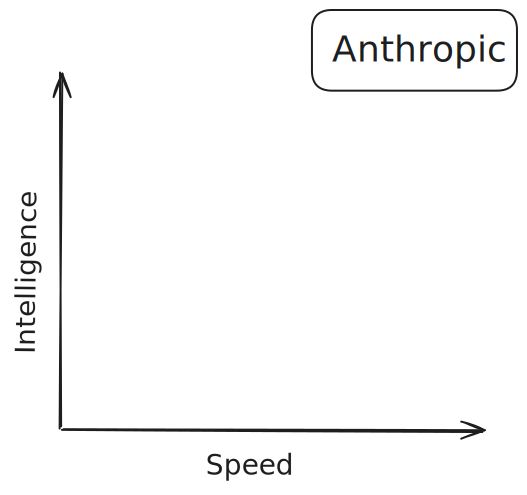
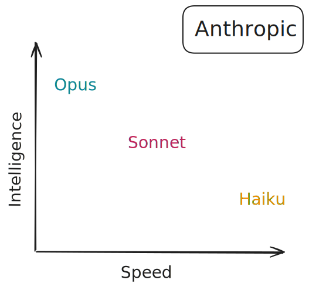
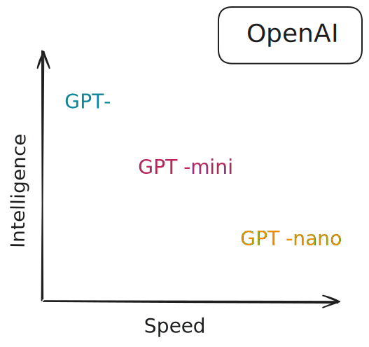
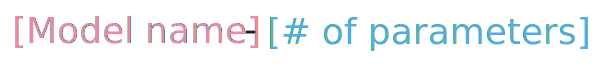
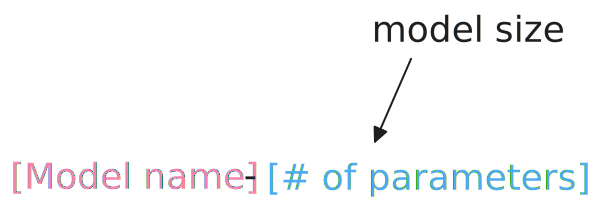
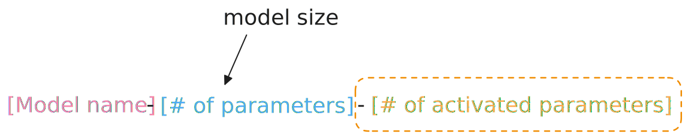
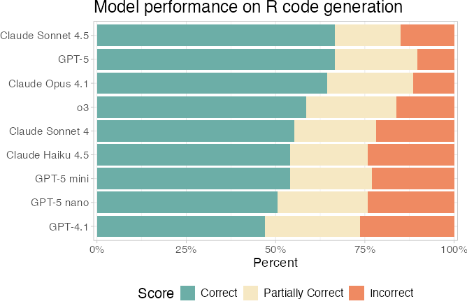
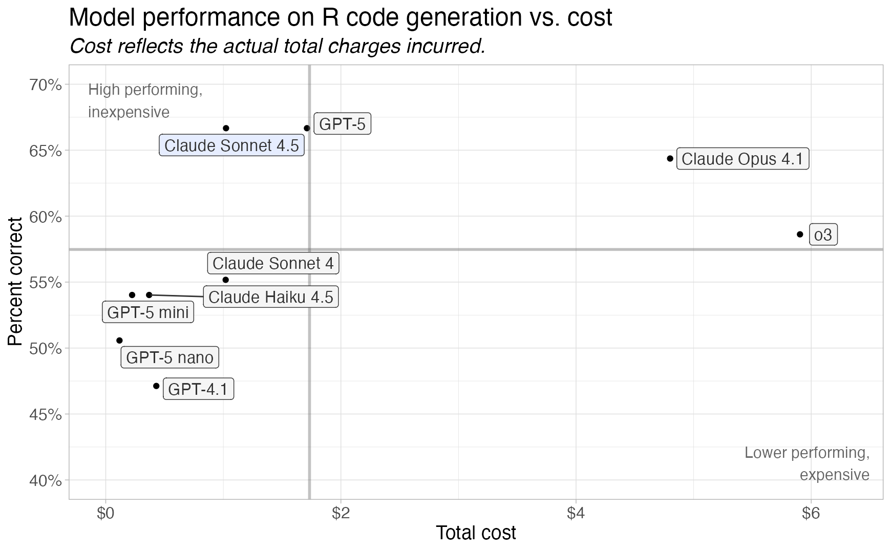
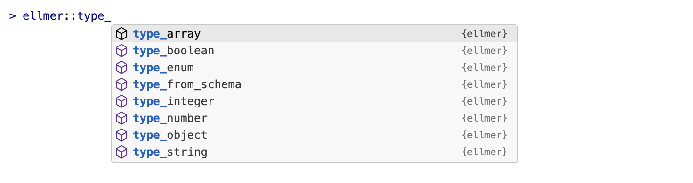

```{r}
source("_incremental_slides.R")
```

# [Providers and Models]{.white .ph4 style="background-color: #4ea8a7e6;"} {.no-invert-dark-mode background-image="assets/sunira-moses-Naj9-n5apvs-unsplash.jpg" background-size="cover" background-position="center"}

::: footer
Photo by <a href="https://unsplash.com/@suniramoses?utm_source=unsplash&utm_medium=referral&utm_content=creditCopyText">Sunira Moses</a> on <a href="https://unsplash.com/photos/Naj9-n5apvs?utm_source=unsplash&utm_medium=referral&utm_content=creditCopyText">Unsplash</a>
:::

::: notes
Now that you know how to use ellmer, let's talk about choosing which model to use. There are many providers and many models to choose from.
:::

## {.center}

::: notes
First, let's clarify two terms: a provider is a company that hosts and serves models. A model is a specific LLM with particular capabilities.
:::

::: {.r-fit-text .incremental}
**Provider**
:    company that hosts and serves models

**Model**
:    a specific LLM with particular capabilities
:::

```{=html}
<style>
dt {
  line-height: 0.8;
}

dd {
  margin-bottom: 1em;
  margin-left: 0 !important;
}

dd:before {
  content: "\2192";
  font-family: var(--r-code-font);
  font-size: 0.8em;
  opacity: 0.66;
}
</style>
```

## How are models different?

::: notes
Models differ across several dimensions. Let's look at the main factors you'll consider when choosing a model.
:::

::: incremental
1. **Content:** How many tokens can you give the model?
1. **Speed:** How many tokens per second?
1. **Cost:** How much does it cost to use the model?
1. **Intelligence:** How smart is the model?
1. **Capabilities:** Vision, reasoning, tools, etc.
:::

::: notes
1. Content: 200k tokens is normal, 1M tokens in some newer models
1. Speed: Speed is often a trade-off with intelligence.
1. Cost: $1-5 per million input tokens is normal for big frontier models, < $1 for smaller, faster models
1. Intelligence is a stand-in for lots of concepts
:::

## {transition="fade"}

{style="display: block; margin: auto;"}

::: notes
naming can be kind of confusing for all providers, so we'll just quickly go through it 

We'll start with Anthropic. they make a family of models they call claude
:::

## {transition="fade"}

{style="display: block; margin: auto;"}

::: notes
Claude models comes in different sizes, with different levels of intelligence and speed. 

they naemd their three model families after types of poetry:

* Haiku is small, fast, and cheap
* Sonnet is larger, more expensive, and more intelligent
* Opus is the largest, most expensive, and most intelligent

When you're choosing a model, you can get higher quality responses by moving up a size tier.

And when new releases come out, you can often get similar quality improvements by moving up a version number.
(This move tends to be cheaper than moving up a size tier.)

so all these families have different number versions which indicates how new they are. so for opus, the newest is 4.7, sonnet is 4.6, haiku 4.5
:::

## {transition="fade"}

::: notes

All the major providers follow similar patterns - small/fast/cheap, medium/balanced, large/smart/expensive models.
So when choosing a model, think about whether you need speed or intelligence, and pick the size that matches your needs.
:::

{style="display: block; margin: auto;"}

## {#model-comparison .smaller}

::: notes
for openai, they have the GPT- models 
their largest are gpt or gpt pro
and then mini and nano are smaller and faster and cheaper
:::

## Local/open weights models

::: notes
google also has the gemini models, which we aren't going to talk about today purely for efficiency, but the latest gemini models are also pretty good. 

but you don't have to use a major model provider or even pay for tokens directly. there are local or open weights models that you or your organization may be able to run locally, or that you can run on a rented server. 

these have typically been lower ability, but have really been improving recently. 
:::

* Models that you (or your organization) can run on your own.
* Naming schemes can be even more confusing
* Use via HuggingFace, LM Studio, Ollama

## Local/open weights models

{style="display: block; margin: auto;"}

::: notes
qwen 3.6 and gemma 4 are two recent examples of good local models

the naming conventions for local models can be even more confusing though
::: 

## Local/open weights models

{style="display: block; margin: auto;"}

## Local/open weights models

{style="display: block; margin: auto;"}

## Local/open weights models

{style="display: block; margin: auto;"}

## For example

* **gemma-4**-*31B*
* **qwen-3.6**-*27B*                                                               
* **gemma-4**-*35B*-**A3B** 


## How to choose a model 

* If you have your pick: pick a recent frontier model, then move to a cheaper one if needed 

::: {.fragment}
but you don't always have your pick!
:::


::: notes
you're probably not doing anything where you need to worry about cost effectiveness right away. 
:::

## {#ellmer .center transition="fade"}

::: notes
Now let's see how to actually use different providers and models in ellmer. Ellmer supports all the major providers plus local models and enterprise options.
:::

:::::: {style="display: flex; flex-direction: row; align-items: center; gap: 1em;"}
::::: {.column style="flex: 0 0 auto;"}
{width="200px"}
:::::

::::: {.column}
:::: fragment
**Providers**

::: incremental
* `chat_openai()`

* `chat_anthropic()` / `chat_claude()`

* `chat_google_gemini()`
:::
::::

:::: fragment
**Open weights/local models**

* `chat_ollama()`
* `chat_huggingface()`
::::

:::: fragment
**Enterprise**

* `chat_aws_bedrock()`
::::

:::: fragment
and more!
::::
:::::
::::::

::: footer
<https://ellmer.tidyverse.org/>
:::

## Shortcut - `chat()` {transition="fade"}

::: notes
Ellmer has a shortcut - the chat() function. Just pass a provider name and it picks a good default model for you.

which is what we did earlier
:::

::: {style="--code-font-size: 0.9em"}

```{.r code-line-numbers="3"}
library(ellmer)

chat <- chat("anthropic")
```
:::

## Shortcut - `chat()` {transition="fade"}

::: notes
See? It tells you which model it chose - Claude Sonnet 4.6.
:::

::: {style="--code-font-size: 0.9em"}

```{.r code-line-numbers="3-4"}
library(ellmer)

chat <- chat("anthropic")
#> Using model = "claude-sonnet-4-5-20250929".
```
:::

## Shortcut - `chat()` {transition="fade"}

::: notes
Works the same way with OpenAI - it picks GPT-4.1 as the default.
:::

::: {style="--code-font-size: 0.9em"}

```{.r code-line-numbers="3-4"}
library(ellmer)

chat <- chat("openai")
#> Using model = "gpt-4.1".
```
:::

## Shortcut - `chat()` {transition="fade"}

::: notes
Or if you want a specific model, use "provider/model-name" format.
:::

::: {style="--code-font-size: 0.9em"}

```{.r code-line-numbers="3"}
library(ellmer)

chat <- chat("anthropic/claude-opus-4-7")
```
:::

# Your Turn `03_models` {.slide-your-turn}

::: notes
Try using different models and see how they compare. This activity helps you get a feel for the differences between models.
:::



1. Use `ellmer` to list available models from Anthropic and OpenAI.

2. Send the same prompt to different models and compare the responses.

3. Feel free to change the prompt!

## How to choose a model

::: notes
If you want to be more systematic about model selection, the vitals package lets you run evaluations — benchmark your specific task across models to see which performs best.

we aren't really going to talk about this today 
:::


::: footer
<http://vitals.tidyverse.org>
:::

## How to choose a model

::: columns

::: {.column width="50%"}

:::

::: {.column width="50%"}



:::

:::

::: footer
<http://vitals.tidyverse.org>
:::

# [Multi-modal input]{.hidden} {background-image="assets/bud-helisson-kqguzgvYrtM-unsplash.jpg" background-size="cover" background-position="center"}

::: footer
Photo by <a href="https://unsplash.com/@budhelisson?utm_source=unsplash&utm_medium=referral&utm_content=creditCopyText">Bud Helisson</a> on <a href="https://unsplash.com/photos/kqguzgvYrtM?utm_source=unsplash&utm_medium=referral&utm_content=creditCopyText">Unsplash</a>
:::

::: notes
Modern LLMs aren't just text - they can handle images and PDFs too. This is called multi-modal input.
:::

[Multi-modal input]{.white .b .absolute top="-400px" right=0 style="font-size: 3em;"}

## A picture is worth a thousand words {.center}

::: notes
Images get tokenized just like text. For LLMs, an image is roughly 170 tokens.
:::

::: fragment
Or for an LLM, a picture is roughly 227 words, or [170 tokens]{.b .blue}.
:::

## 🌆 content_image_file {transition="fade"}

::: notes
Use content_image_file() to pass an image from your local filesystem. Just provide the path to the image.
:::

::: {style="--code-font-size: 0.9em"}

```{.r code-line-numbers="4-7"}
library(ellmer)

chat <- chat("anthropic/claude-haiku-4-5-20251001")
chat$chat(
  content_image_file("cats.jpg"),
  "What do you see in this image?"
)
```
:::

## [🐈](https://placecats.com/bella/400/400){target="_blank" rel="noopener noreferrer"} content_image_url {transition="fade"}

::: notes
Or use content_image_url() to pass an image from a URL. Same pattern, different source.
:::

::: {style="--code-font-size: 0.9em"}

```{.r code-line-numbers="5"}
library(ellmer)

chat <- chat("anthropic/claude-haiku-4-5-20251001")
chat$chat(
  content_image_url("https://placecats.com/bella/400/400"),
  "What do you see in this image?"
)
```
:::

## 📑 content_pdf_file / content_pdf_url

::: notes
LLMs can also read PDFs. Use content_pdf_file() to pass a PDF from your filesystem.
:::

::: {style="--code-font-size: 0.9em"}

```{.r code-line-numbers="5"}
library(ellmer)

chat <- chat("anthropic/claude-haiku-4-5-20251001")
chat$chat(
   content_pdf_file("prescribing-information.pdf"),
  "List the contraindications and serious adverse reactions."
)
```
:::

# [Structured output]{.title-push-down .dib .bg-black .ph4 .white} {.no-invert-dark-mode background-image="assets/vitaly-taranov-J6hE2DTWSEw-unsplash.jpg" background-size="cover" background-position="center"}

::: footer
Photo by <a href="https://unsplash.com/@vitrfrgl?utm_source=unsplash&utm_medium=referral&utm_content=creditCopyText">Vitaly Taranov</a> on <a href="https://unsplash.com/photos/J6hE2DTWSEw?utm_source=unsplash&utm_medium=referral&utm_content=creditCopyText">Unsplash</a>
:::

::: notes
Now let's talk about structured output - getting LLMs to return data in a predictable format instead of free text.
:::

## How would you extract name and age? {style="--code-font-size: 0.66em"}

::: notes
Here's a common problem - you have messy text data and need to extract specific fields like name and age.
:::

```{r}
#| echo: true
age_free_text <- list(
  "I go by Alex. 42 years on this planet and counting.",
  "Pleased to meet you! I'm Jamal, age 27.",
  "They call me Li Wei. Nineteen years young.",
  "Fatima here. Just celebrated my 35th birthday last week.",
  "The name's Robert - 51 years old and proud of it.",
  "Kwame here - just hit the big 5-0 this year."
)
```

## If you wrote R code, it might look like this... {.scrollable style="--code-font-size: 0.66em"}

::: notes
If you tried to solve this with traditional R code, you'd need complex regex patterns and string parsing. This is painful.
:::

```{r}
#| echo: true
word_to_num <- function(x) {
  # normalize
  x <- tolower(x)
  # direct numbers
  if (grepl("\\b\\d+\\b", x)) {
    return(as.integer(regmatches(x, regexpr("\\b\\d+\\b", x))))
  }
  # hyphenated like "5-0"
  if (grepl("\\b\\d+\\s*-\\s*\\d+\\b", x)) {
    parts <- as.integer(unlist(strsplit(
      regmatches(x, regexpr("\\b\\d+\\s*-\\s*\\d+\\b", x)),
      "\\s*-\\s*"
    )))
    return(10 * parts[1] + parts[2])
  }
  # simple word numbers
  ones <- c(
    zero = 0,
    one = 1,
    two = 2,
    three = 3,
    four = 4,
    five = 5,
    six = 6,
    seven = 7,
    eight = 8,
    nine = 9,
    ten = 10,
    eleven = 11,
    twelve = 12,
    thirteen = 13,
    fourteen = 14,
    fifteen = 15,
    sixteen = 16,
    seventeen = 17,
    eighteen = 18,
    nineteen = 19
  )
  tens <- c(
    twenty = 20,
    thirty = 30,
    forty = 40,
    fifty = 50,
    sixty = 60,
    seventy = 70,
    eighty = 80,
    ninety = 90
  )
  # e.g., "nineteen"
  if (x %in% names(ones)) {
    return(ones[[x]])
  }
  # e.g., "thirty five" or "thirty-five"
  x2 <- gsub("-", " ", x)
  parts <- strsplit(x2, "\\s+")[[1]]
  if (
    length(parts) == 2 && parts[1] %in% names(tens) && parts[2] %in% names(ones)
  ) {
    return(tens[[parts[1]]] + ones[[parts[2]]])
  }
  if (length(parts) == 1 && parts[1] %in% names(tens)) {
    return(tens[[parts[1]]])
  }
  return(NA_integer_)
}

# Extract name candidates
extract_name <- function(s) {
  # patterns that introduce a name
  pats <- c(
    "I go by\\s+([A-Z][a-z]+)",
    "I'm\\s+([A-Z][a-z]+(?:\\s+[A-Z][a-z]+)?)",
    "They call me\\s+([A-Z][a-z]+(?:\\s+[A-Z][a-z]+)?)",
    "^([A-Z][a-z]+) here",
    "The name's\\s+([A-Z][a-z]+)",
    "^([A-Z][a-z]+)\\s" # fallback: leading capital word
  )
  for (p in pats) {
    m <- regexpr(p, s, perl = TRUE)
    if (m[1] != -1) {
      return(sub(p, "\\1", regmatches(s, m)))
    }
  }
  NA_character_
}

# Extract age phrases and convert to number
extract_age <- function(s) {
  # capture common age phrases around a number
  m <- regexpr(
    "(\\b\\d+\\b|\\b\\d+\\s*-\\s*\\d+\\b|\\b[Nn][a-z-]+\\b)\\s*(years|year|birthday|young|this)",
    s,
    perl = TRUE
  )
  if (m[1] != -1) {
    token <- sub(
      "(years|year|birthday|young|this)$",
      "",
      trimws(substring(s, m, m + attr(m, "match.length") - 1))
    )
    return(word_to_num(token))
  }
  # handle pure word-number without trailing keyword (e.g., "Nineteen years young." handled above)
  m2 <- regexpr("\\b([A-Z][a-z]+)\\b\\s+years", s, perl = TRUE)
  if (m2[1] != -1) {
    token <- tolower(sub("\\s+years.*", "", regmatches(s, m2)))
    return(word_to_num(token))
  }
  # handle hyphenated "big 5-0"
  m3 <- regexpr("big\\s+(\\d+\\s*-\\s*\\d+)", s, perl = TRUE)
  if (m3[1] != -1) {
    token <- sub("big\\s+", "", regmatches(s, m3))
    return(word_to_num(token))
  }
  NA_integer_
}
```

## If you wrote R code, it might look like this... {.scrollable}

::: notes
And here's what running that code looks like. It works, but look at all the code you had to write!
:::

::: {.easy-columns .gap-2}
```{r}
#| echo: true
dplyr::tibble(
  name = purrr::map_chr(age_free_text, extract_name),
  age = purrr::map_int(age_free_text, extract_age)
)
```

```{r}
#| echo: true
age_free_text
```
:::

## But if you ask an LLM... {transition="fade"}

::: notes
But with an LLM, you can just ask it to extract the name and age. Much simpler!
:::

```{.r code-line-numbers="4-5|8,11"}
library(ellmer)

chat <- chat(
  "anthropic/claude-sonnet-4-6",
  system_prompt = "Extract the name and age."
)

chat$chat(age_free_text[[1]])
#>

chat$chat(age_free_text[[2]])
#>
```

## But if you ask an LLM... {transition="fade"}

::: notes
And it works! The LLM correctly extracts names and ages. But the output is still free text - wouldn't it be nice to get proper R objects?
:::

```{.r code-line-numbers="8-12"}
library(ellmer)

chat <- chat(
  "anthropic/claude-sonnet-4-6",
  system_prompt = "Extract the name and age."
)

chat$chat(age_free_text[[1]])
#> Name: Alex; Age: 42

chat$chat(age_free_text[[2]])
#> Name: Jamal; Age: 27
```

## Wouldn't this be nice? {transition="fade"}

::: notes
What we really want is a proper R list with named fields. That's what structured output gives us.
:::

```{.r}
chat$chat(age_free_text[[1]])
#> list(
#>   name = "Alex",
#>   age = 42
#> )
```

## Structured chat output {transition="fade"}

::: notes
Enter chat_structured() - this method returns structured data instead of text. But we need to tell it what structure we want.
:::

```{.r code-line-numbers="1"}
chat$chat_structured(age_free_text[[1]])
#> list(
#>   name = "Alex",
#>   age = 42
#> )
```

## Structured chat output {transition="fade"}

::: notes
Define the structure with type_object() - specify each field and its type. Then pass it to chat_structured().
:::

```{.r code-line-numbers="1-4|6"}
type_person <- type_object(
  name = type_string(),
  age = type_integer()
)

chat$chat_structured(age_free_text[[1]], type = type_person)
#> list(
#>   name = "Alex",
#>   age = 42
#> )
```

## Structured chat output {transition="fade"}

::: notes
And you get back proper R objects - a character vector for name, an integer for age. Ready to use in your analysis!
:::

```{.r code-line-numbers="7-11"}
type_person <- type_object(
  name = type_string(),
  age = type_integer()
)

chat$chat_structured(age_free_text[[1]], type = type_person)
#> $name
#> [1] "Alex"
#>
#> $age
#> [1] 42
```

## ellmer's type functions

::: notes
Here are all the type functions available in ellmer. You can also add descriptions to help the LLM understand what each field means.
:::



::: fragment
```{.r}
type_person <- type_object(
  name = type_string("The person's name"),
  age = type_integer("The person's age in years")
)
```
:::

# Your Turn `04_structured-output` {.slide-your-turn}

::: notes
This exercise uses simulated clinical notes. Students extract patient name, age, diagnoses, and medications into structured R objects. Same pattern as the name/age example but more realistic for this audience.
:::

1. `data/clinical-notes.R` contains fictional clinical notes (free text).

1. Use `ellmer::type_*()` to extract structured patient data (name, age, diagnoses, medications).

1. I've given you the expected structure, you just need to implement it.

