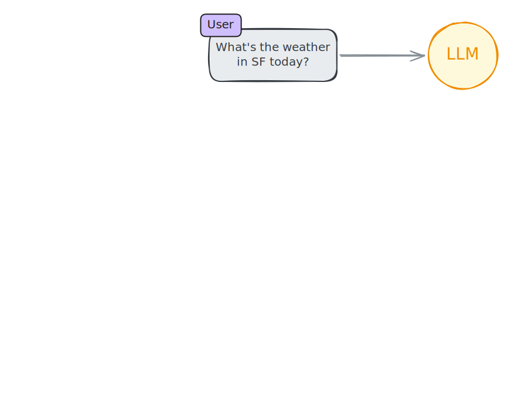
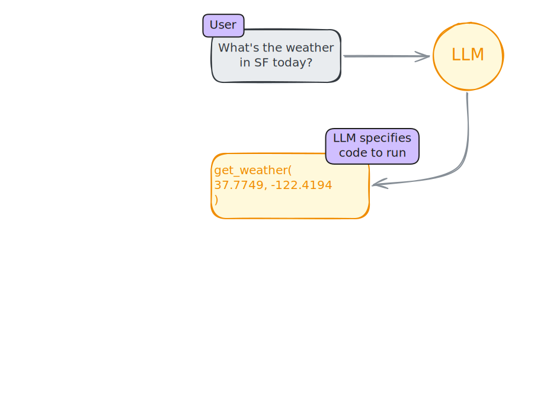
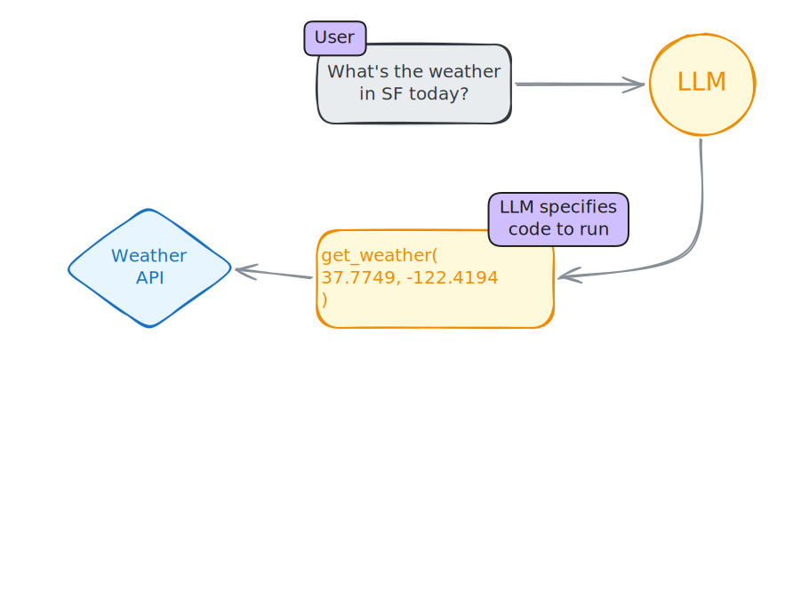
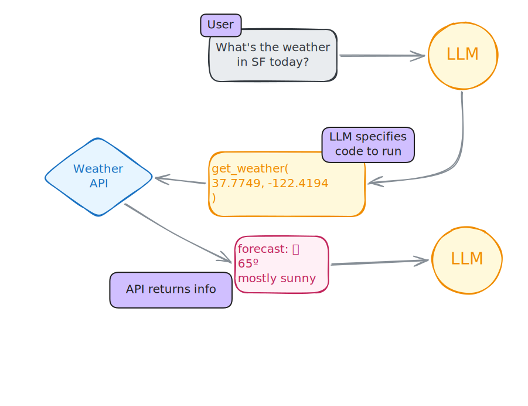
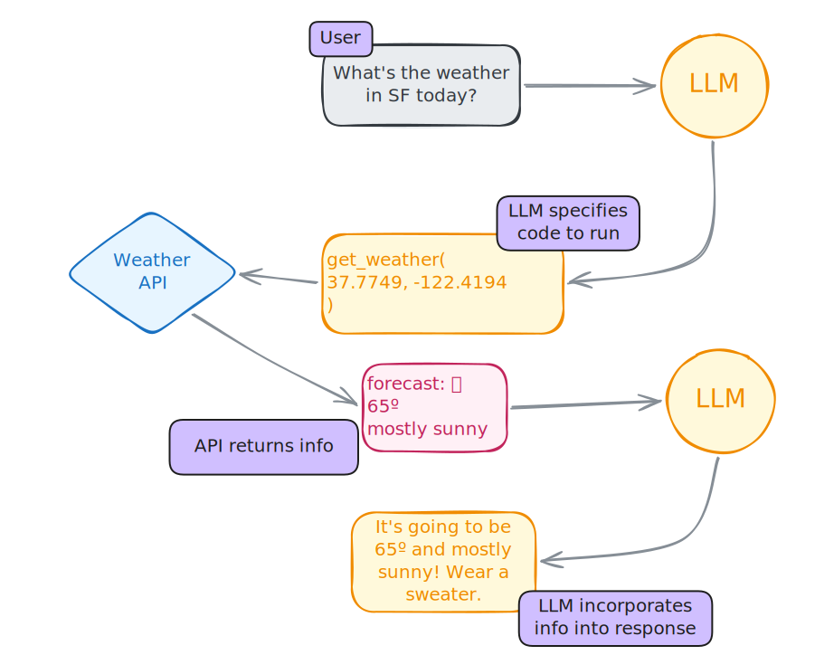
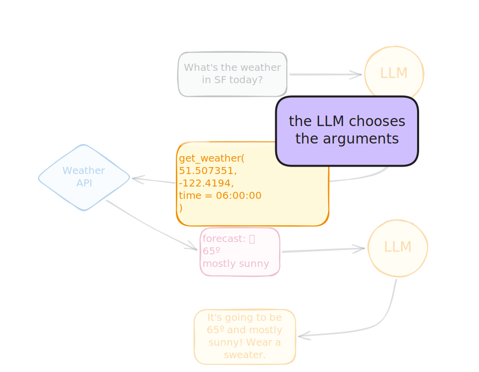

::: notes
we just saw how to add knowledge with prompting
now we're going to talk about how to add abilities with tools
another way to make llms useful for you by giving them new abilities that they don't have out of the box
:::


## How do LLMs actually work?

::: fragment
_On their own, can LLMs... access the internet? run code? send an email? interact with the world?_
:::

::: notes
Before we dive into tools, let's clarify what LLMs can and can't do. can they...?
lets try it out
:::

## 

::: notes
what happens if we ask about the current weahter?

The model can't access real-time weather data. No internet connection.
:::

```{.r}
chat <- chat("anthropic/claude-haiku-4-5")

chat$chat("What's the weather like in San Francisco?")
```

::: fragment
```{.markdown code-line-numbers="false"}
I don't have access to real-time weather data, so I can't tell
you the current conditions in San Francisco.
```
:::

<br>
<br>

::: fragment
### LLMs don't have access to real-time data!
:::

## 

::: notes
what about asking it to affect the world, like writing a file to your computer?

They also can't interact with the file system, send emails, or take any real-world actions.

at this point you might be thinking...
:::

```{.r}
chat <- chat("anthropic/claude-haiku-4-5")

chat$chat("Write df to data/data.csv")
```

::: fragment
```{.markdown code-line-numbers="false"}
I'm not able to actually execute code or 
write files to your system. I can only provide 
code snippets and guidance.
```
:::

<br>

<br>

::: fragment
### LLMs can't affect the world!
:::

## Tool = function + metadata {.center}

::: notes
So how do we solve these problems? Tools! 

Tools are extra capabilities that you give to the LLM, like the ability to check the weather or query a database.
These capabilities are things that the model can't do on its own.

tools are essentially just functions + metadata. if you've ever written an R function and then documented it, you can write a tool. it's basically the same process, just iwth an LLM as the intended audience instead of another human.

so we can use tools to **click**...
:::

::: incremental
* Bring real-time or up-to-date information to the model
* Let the model interact with the world
:::

# Tools in R

## Tool = function + metadata 

**Step 1**

Write (or find) an R function that carries out your desired functionality. 

```{.r}
get_weather <- function(latitude, longitude) {
  # Return weather for that location
}
```

::: notes
were going to make a tool so the llm can get the current weather
:::

## Tool = function + metadata 

**Step 2**

Document that function for the LLM.   

```{.r code-line-numbers="5-9"}
get_weather <- function(latitude, longitude) {
  # Return weather for that location
}

get_weather_tool <- tool(
  fun = get_weather,
  description = "Get the weather for a location",
  arguments = # Specify arguments
)
```

## Tool = function + metadata 

Step 3: Register the tool   

```{.r code-line-numbers="11"}
get_weather <- function(latitude, longitude) {
  # Return weather for that location
}

get_weather_tool <- tool(
  fun = get_weather,
  description = "Get the weather for a location",
  arguments = # Specify arguments
)

chat$register_tool(get_weather_tool)
```

::: notes
tell your chat about the tool
LLM now knows this tool exists and can request to use it
:::

## Tool = function + metadata

```{.r code-line-numbers="1-3|5|6|7|8-12|15"}
get_weather <- function(latitude, longitude) {
  weathR::point_forecast(latitude, longitude)
}

get_weather_tool <- tool(
  fun = get_weather,
  description = "Get the weather for a location",
  arguments = 
    list(
      latitude = type_number("Latitude"),
      longitude = type_number("Longitude")
  )
)

chat$register_tool(get_weather_tool)
```

::: notes
take a look in more detail

1. create a function that does our desired functionality
2. then we annotate it with the tool() function, basically just telling the LLM how to use it. description, arguments with types
3. finally, we register it, which tells the llm the tool exists and is available for use 
:::


## Tool = function + metadata

::: notes
simplify a bit
:::

```{.r}
get_weather <- tool(
  \(lat, lon) weathR::point_forecast(lat, lon),
  name = "get_weather",
  description = "Get the weather for a location.",
  arguments = list(
    lat = type_number("Latitude"),
    lon = type_number("Longitude")
  )
)

chat$register_tool(get_weather)
```

## Now the model can tell us the weather

::: notes
Now when we ask about the weather, the LLM calls our tool. It figured out the lat/lon for San Francisco on its own. The tool returns real data, and the model formats it nicely.
:::

```{.r}
chat$chat("What's the weather in San Francisco?")
```

::: fragment

```{.markdown code-line-numbers="|1|2|3-10"}
◯ [tool call] get_weather(lat = 37.7749, lon = -122.4194)
● #> [{"time":"2026-05-01 14:00:00 PDT","temp":65,"dewpoint":1…
Here's the current weather for San Francisco:

**Current conditions (May 1, 2:00 PM PDT):**
- Temperature: 65°F
- Conditions: Mostly Sunny
- Humidity: 72%
- Wind: WSW at 7 mph
- Chance of rain: 0%
```
:::

## `type_()` functions

```{.r code-line-numbers="5-8"}
get_weather <- tool(
  \(lat, lon) weathR::point_forecast(lat, lon),
  name = "get_weather",
  description = "Get the weather for a location.",
  arguments = list(
    lat = type_number("Latitude"),
    lon = type_number("Longitude")
  )
)

chat$register_tool(get_weather)
```

::: notes
you might have noticed the type functions
way to specify object types for the llm in a way it will easily understand

saw this earlier for structured data
::: 

## `type_()` functions

```{.r code-line-numbers="false"}
type_boolean(description = NULL, required = TRUE)

type_integer(description = NULL, required = TRUE)

type_number(description = NULL, required = TRUE)

type_string(description = NULL, required = TRUE)

type_enum(values, description = NULL, required = TRUE)

type_array(items, description = NULL, required = TRUE)

type_object(
  .description = NULL,
  ...,
  .required = TRUE,
  .additional_properties = FALSE
)
```

::: notes
use the appropriate type function
:::

# How does tool calling work?

::: notes
Let me walk you through exactly how tool calling works step by step. This is the key pattern you need to understand.
:::

## {.center style="text-align: center" transition="fade"}



::: notes
The conversation starts with a user sending a message to the chatbot.

In this example, the user asks about hte weather 

The model doesn't have access to real-time weather data, just like we saw earlier 
:::

## {.center style="text-align: center" transition="fade"}



::: notes
Now imagine we've told the LLM that it has access to a tool called `get_weather()`.
Knowing that it needs weather information and doesn't have access to real-time data, the model decides to use the weather tool.

It sends back a message that includes a tool call - basically instructions to call the `get_weather()` function with the appropriate location argument.
The model uses its training data to figure out the right location format (like a ZIP code).
:::

## {.center style="text-align: center" transition="fade"}



::: notes
ellmer takes that tool call message and executes the actual function in your R session - in this case, querying a weather API with the location the model specified.
:::

## {.center style="text-align: center" transition="fade"}



::: notes
The weather API sends back some data:

* The forecast is mostly sunny
* High of 98ºF
* Low of 78ºF

ellmer then sends that data back to the LLM.
Note that it's often in a pretty raw format, like JSON.
:::

## {.center style="text-align: center" transition="fade"}



::: notes
llm incorporates into response
:::

## {.center style="text-align: center" transition="fade"}


::: notes
ellmer handles all this communication here for you.
:::


## The LLM cannot run code by itself!

::: notes
This is crucial to understand - the LLM doesn't execute tools. LLMs cant run code. It just asks you (ie. your computer) to run them. the tool code is running like normal r code on your laptop, not in a cloud somewhere
:::

It just requests that tools be run.

::: fragment
The LLM controls:

::: incremental
1. **When** the tool is called
2. **How** the tool is called (i.e., the arguments)
:::
:::

## {.center style="text-align: center" transition="fade"}


## {.center style="text-align: center" transition="fade"}

::: notes
The LLM also chooses the arguments for the tool. It uses its knowledge to fill in the right values - using information from its training data.
:::



## Helper function: `create_tool_def()`

```{.r}
create_tool_def(rnorm)
```

::: {.fragment}

```{.markdown}
Using model = "gpt-4.1".
tool(
  stats::rnorm,
  "Generates random deviates from the normal distribution with specified mean and standard deviation.",
  n = type_integer(
    "Number of observations. If length(n) > 1, the length is taken to be the number required.",
    required = TRUE
  ),
  mean = type_number(
    "Mean(s) of the normal distribution. Defaults to 0.",
    required = FALSE
  ),
  sd = type_number(
    "Standard deviation(s) of the normal distribution. Defaults to 1.",
    required = FALSE
  )
)
```
:::

::: notes
if you already have a function defined and documented
:::


# Your Turn `06_tool-calling` {.slide-your-turn}

::: notes
Now practice the full pattern: write a function, wrap it as a tool, register it, and chat. The function filters health expenditure data for a given country.
:::

1. Write a `get_country_spending()` function that takes a country name and year and returns health spending by purpose.

1. Wrap it as a tool with `tool()` and register it.

1. Ask the model about spending for a specific country.



::: notes
to highlight: does the model have access to the data? what does the model control? how could we make this function better?
:::

## Some questions

::: notes
These are important conceptual questions to reinforce. The model never sees your data directly — it only sees what the tool function returns. And the model only controls when to call and what arguments to pass.

data? no just choosing argument for country and year
control? arguments 
could be better.
:::

::: {.fragment}
**Does the model have access to the data?**
:::


::: {.fragment}
No.
:::

::: {.fragment}
**What does the model control?**
::: 

::: {.fragment}
* When to use the tool.
* What arguments to pass to the function. In this case, just the year and country. 
:::

::: {.fragment}
**How could we make this function better?**
:::

::: {.fragment}
* Give the model access to the list of countries and years available. 
* Think through failure modes. 
:::

## Built-in web search tools

::: notes
ellmer also comes with built-in tools for popular providers. These solve the exact problem we saw earlier - the model couldn't look up current information. With a web search tool, it can.
:::

```{.r}
chat <- chat_anthropic()
chat$register_tool(claude_tool_web_search())
chat$chat("Who are the keynote speakers at R/Medicine 2026?")
```

::: fragment
Also available: `openai_tool_web_search()`, `google_tool_web_search()`
:::

