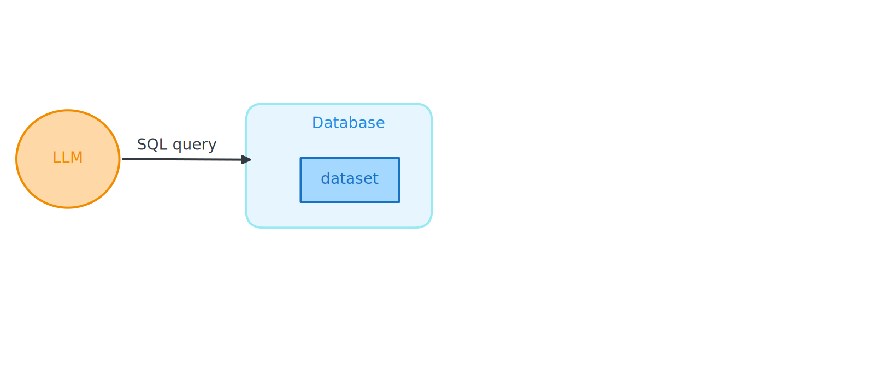
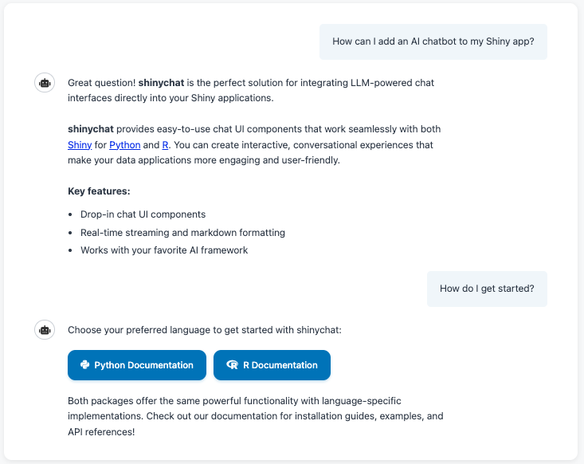

## What is [querychat](https://posit-dev.github.io/querychat/r/)? {.center}

::: footer
<https://posit-dev.github.io/querychat/r/>
:::

::: notes
querychat is a package from Posit that lets you explore tabular data using natural language. Instead of writing SQL or dplyr code, you just ask questions in plain English.
:::

::: incremental
* Explore data using **natural language**

* Built on top of **ellmer** and **Shiny**

* Works with data frames and database connections
:::

## How does querychat work?

::: notes
Here's the key insight: the LLM writes SQL queries, but a database executes them. The LLM never touches your raw data directly. 

this has a variety of benefits
:::

::: incremental
1. You ask a question in natural language

2. The LLM writes a **SQL query**

3. A **database** executes the query

4. You get back real, filtered data
:::

## Benefits

::: notes
This architecture gives us several important properties,
:::

::: incremental
* **Reliable** — the database runs the queries, not the LLM. No hallucinated numbers.

* **Safe** — limited to read-only queries. No data destruction.

* **Reproducible** — SQL can be exported and re-run.
:::

## The simplest version

::: notes
querychat is built on shiny, but you don't really need to know shiny today. i want to give you an overview of querychat becasue it's pretty useful, so we're just going to make a really simple app. 
You can get started with just two lines of code. querychat_app() launches a full chat interface for exploring any data frame.
:::

```{.r}
library(querychat)

querychat_app(your_data)
```

## Demo {.center}

::: notes
Let me show you what this looks like. This is a full Shiny dashboard with querychat embedded — you can filter the data using natural language and the plots and map update automatically.
:::

👩‍💻 [_demos/05_querychat/05_querychat-dashboard.R]{.code .b .purple}

## {.center style="text-align: center" transition="fade"}

::: notes
lets take a closer look at how querychat works. 
the LLM takes in a user's questino and writes the appropriate sql query. the database executes that query, updating the underlying data used in the app (if you know shiny, it's updating reactives). The model never sees your raw data. it may see the result of the query though 
:::



## {.center style="text-align: center" transition="fade"}


# Your Turn `08_querychat` {.slide-your-turn}

::: notes
Now it's your turn. Open the exercise file, run it, and explore the health expenditure data with natural language. Try asking questions about countries, spending purposes, and trends over time.
:::

1. Open `08_querychat-app.R` and fill in the `querychat_app()` call.

2. Run it and explore the health expenditure dataset with natural language.

3. Try questions like:
   - "Which country spent the most on preventive care in 2020?"
   - "Show me spending by purpose for Japan"



## {.center style="text-align: center"}

::: notes
there is a lot more to querychat! the querychat website is very helpful, and you might take a look at this build an app vignette if you want to build a more involved app

querychat_app just gives you the basics.
:::


::: footer
  <https://posit-dev.github.io/querychat/r/articles/build.html>
:::     

## shinychat {.center style="text-align: center"}

::: notes
also useful to know about shinychat, which querychat is built on.
shinychat lets you build chatbots in shiny
for r and python
:::

::: columns
::: {.column width="30%"}

:::
::: {.column width="70%"}

:::
:::

::: footer
<https://posit-dev.github.io/shinychat/>
:::
