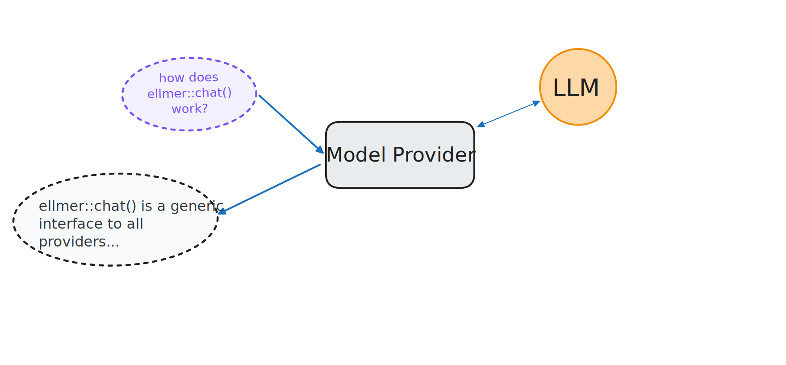
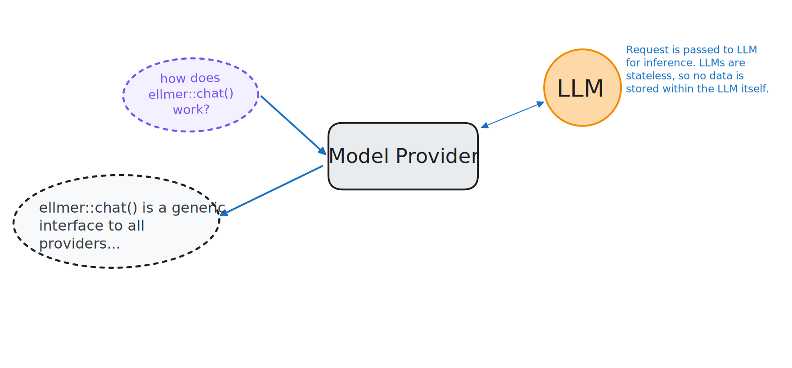

# [Privacy & Security]{.ph5 .pv3 style="background-color: rgba(255, 255, 255);"} {.no-invert-dark-mode background-image="assets/trust-fence.jpg" background-size="cover" background-position="center"}

::: notes
Before we wrap up, important to discuss privacy and security — especially relevant for those working with protected health data.
:::

## Model providers vs. LLMs

::: incremental
* **Provider:** The company that hosts the model (Anthropic, OpenAI, Google, etc.).

* **LLM:** The actual model that generates responses to your queries.

* LLMs are **stateless.** They have no memory of your prior requests.

* However, the model provider may **log and store** your requests.
:::

::: notes
The model doesn't remember you, but the provider's servers might.
:::

## {.center style="text-align: center" transition="fade"}

::: notes
lets walk through the flow of data
when you have a convo, you really only see this
it looks liek you send a message to anthropic or whoever, and you get back a response
:::

## {.center style="text-align: center" transition="fade"}

::: notes
the model provider is responsible for routing your message to the actual model
:::

## {.center style="text-align: center" transition="fade"}

::: notes
remember, LLMs are stateless. so the llm doesn't store your request or any data. it just takes in your request and gives a response
the model provider handles giving that response back to you
:::

## {.center style="text-align: center" transition="fade"}

::: notes
the nuance is that the model provider might do something with your data, and this can vary by rpovider and by agreement you have with the provider.

model training, third party, storage
:::

## {.center style="text-align: center" transition="fade"}

::: notes
when you use something like posit assistant, this diagram doesn't change much 
again, teh llm itself isn't going to retain any of your data. it doesn't automatcaly "learn" or anything. 

and posit doesn't store your data unless two things are true
:::

## You* need to trust your model provider

\* or more likely, your organization

::: {.fragment}
* Know what your model provider does with your data
:::

::: {.fragment}
* ellmer, querychat, shinychat, etc. will never store your data anywhere. They pass the request directly to your specified model provider. 
:::

::: {.fragment}
* Posit Assistant will only store your data if a) you use Posit as your model provider and b) you opt-in. 
:::

## The good news

::: fragment
Your organization can work out a zero data retention (ZDR), HIPAA-compliant agreement, or other arrangements with model providers. These arrangements are common.
:::

::: fragment
**Learn more:** <https://posit.co/blog/trust-llm-tools/>
:::

## Learn more

::: notes
These are the Posit packages for working with AI. We've focused on ellmer and shinychat today, but there are others for different use cases.
:::

# Thank you!
