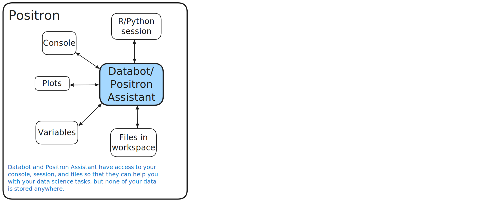
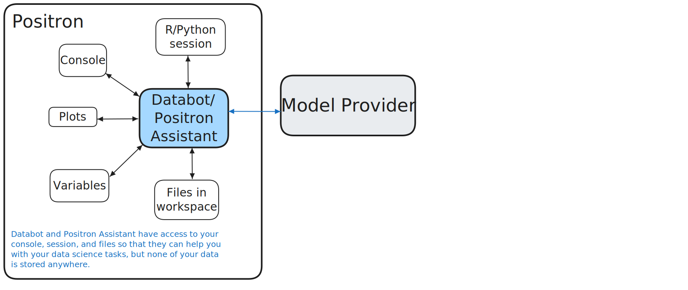
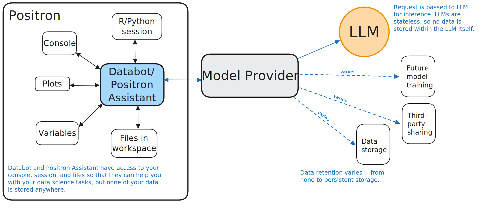
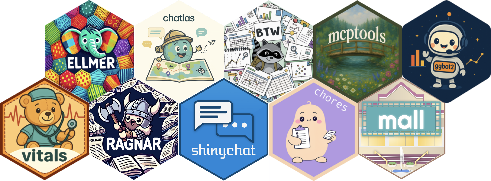

# [Privacy & Security]{.ph5 .pv3 style="background-color: rgba(255, 255, 255);"} {.no-invert-dark-mode background-image="assets/trust-fence.jpg" background-size="cover" background-position="center"}

::: notes
Before we wrap up, important to discuss privacy and security — especially relevant for those working with protected health data.
:::

## Model providers vs. LLMs

::: incremental
* **Provider:** The company that hosts the model (Anthropic, OpenAI, Google, etc.).

* **LLM:** The actual model that generates responses to your queries.

* LLMs are **stateless.** They have no memory of your prior requests.

* However, the model provider may **log and store** your requests.
:::

::: notes
The model doesn't remember you, but the provider's servers might.
:::

## Where does your data go?

{style="display: block; margin-left: auto; margin-right: auto; max-width: 90%;"}

## Where does your data go?

{style="display: block; margin-left: auto; margin-right: auto; max-width: 90%;"}

## Where does your data go?

{style="display: block; margin-left: auto; margin-right: auto; max-width: 90%;"}

## You need to trust your model provider

* **Posit doesn't store your data**

* But your provider might, depending on your agreement

## The good news

::: fragment
Your organization can work out a zero data retention (ZDR), HIPAA-compliant agreement, or other arrangements with model providers. These arrangements are common.
:::

::: fragment
**Learn more:** <https://posit.co/blog/trust-llm-tools/>
:::

## Learn more

::: notes
These are the Posit packages for working with AI. We've focused on ellmer and shinychat today, but there are others for different use cases.
:::

## Learn more

**querychat**: <https://github.com/posit-dev/querychat>

* Chat with your data using natural language queries.

**ggbot2**: <https://github.com/tidyverse/ggbot2>

* Talk out loud to create and iterate on plots.

**Databot**: <https://positron.posit.co/databot.html>

* EDA assistant for Positron.

**vitals**: <https://github.com/posit-dev/vitals>

* Evaluate LLM performance with systematic benchmarks.

**Posit AI newsletter**: <https://posit.co/blog/?post_tag=ai-newsletter>

# Thank you!
