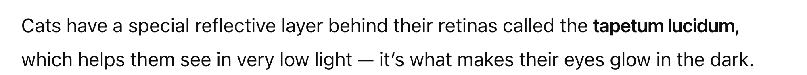
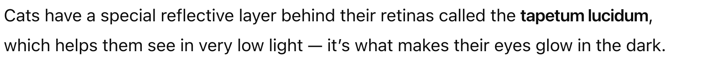
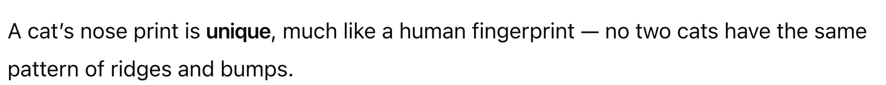
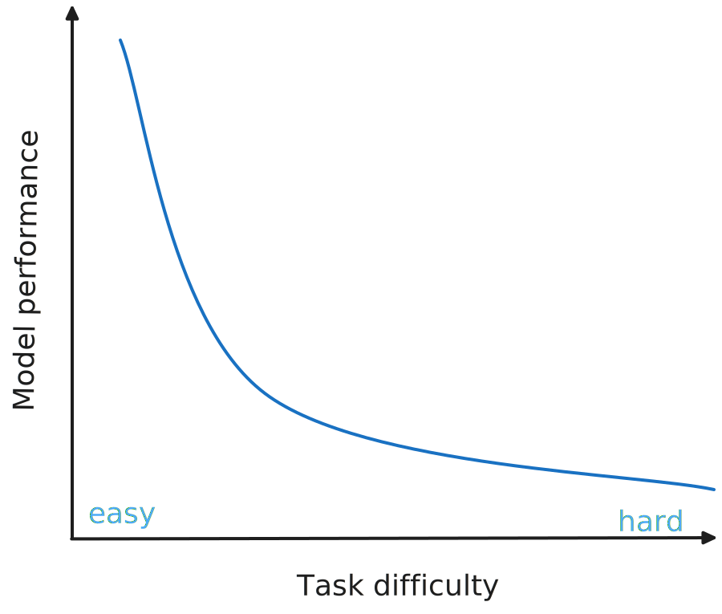
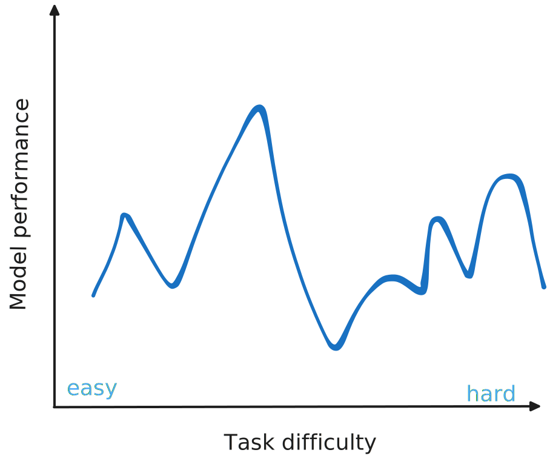

```{r}
# REMOVE
source("_incremental_slides.R")
```

# [Anatomy of a Conversation]{.white} {.title-push-down .no-invert-dark-mode background-image="assets/jaroslaw-glogowski-oAYKzeP0qF4-unsplash.jpg" background-size="cover" background-position="left 30%"}

::: notes
first, let's talk about how talking to llms works
:::

## {.center}


{.fragment}

::: notes
you've probably talked with chatgpt or claude or gemini and seen a conversation that looks something like this:

You ask a question and ChatGPT responds.
You can keep talking to ChatGPT and it keeps responding,
and it feels kind of like you're having a conversation with a person.

how is this happening?
The entire conversation happens via HTTP requests and responses
:::

## We can do this from R!

{style="max-width: 100%; max-height: 500px; display: block; margin-left: auto; margin-right: auto;"}

::: footer
<https://ellmer.tidyverse.org>
:::

##

::: {style="--code-font-size: 0.9em"}
```{.r}
library(ellmer)

chat <- chat("anthropic")

chat$chat("Tell me a quick fact about sheep.")
```
:::

##

::: {style="--code-font-size: 0.9em"}
```{.r}
library(ellmer)

chat <- chat("anthropic")

chat$chat("Tell me a quick fact about sheep.")
#> Sheep have rectangular pupils that give them 
#> a nearly 360-degree field of vision, 
#> allowing them to see predators approaching 
#> from almost any direction without turning 
#> their heads.
```
:::

## How does this work?

Most LLMs are accessible through HTTP APIs

## {transition="fade"}

::: notes
First step - load the ellmer package, just like any other R package.
:::

::: {style="--code-font-size: 0.9em"}
```r
library(ellmer)
```
:::

## {transition="fade"}

::: notes
Now we create a chat object. This sets up a connection to OpenAI's API.
The chat object is what we'll use to send messages and get responses.
:::

::: {style="--code-font-size: 0.9em"}
```{.r code-line-numbers="3"}
library(ellmer)

chat <- chat("anthropic")
```
:::

## {transition="fade"}

::: notes
Now we can use the chat object to send a message using the chat method

and pass in our message as a string.
:::

::: {style="--code-font-size: 0.9em"}
```{.r code-line-numbers="5"}
library(ellmer)

chat <- chat("anthropic")

chat$chat("Tell me a quick fact about sheep.")
```
:::

## {transition="fade"}

::: notes
And we get a response back!

think back to what we just learned about roles.
What are the user and assistant roles in this example?


The user role is our question - "Tell me a quick fact about sheep"
The assistant role is the response we got back.
:::

::: {style="--code-font-size: 0.9em"}
```{.r code-line-numbers="6-10"}
library(ellmer)

chat <- chat("anthropic")

chat$chat("Tell me a quick fact about sheep.")
#> Sheep have rectangular pupils that give them 
#> a nearly 360-degree field of vision, 
#> allowing them to see predators approaching 
#> from almost any direction without turning 
#> their heads.
```
:::

## {transition="fade"}

::: notes
One of the nice things about ellmer is that you can easily inspect the chat object
to see the full conversation history.

If we just call 'chat', we can see all the messages and their roles.
You can see the user message and the assistant response, as well as how many tokens were used

but what about the third role -- the system prompt? where is that?
we didn't set up one, so the model just uses whatever behavior it defaults to
:::

::: {style="--code-font-size: 0.7em"}
```r
chat
```
```{.markdown code-line-numbers="|2|2,4"}
<Chat Anthropic/claude-sonnet-4-5 turns=2 input=15 output=37 cost=$0.00>
── user ─────────────────────────────────────────────────────────────────────────────────
Tell me a quick fact about sheep.
── assistant [input=15 output=37 cost=$0.00] ────────────────────────────────────────────
Sheep have rectangular pupils that give them a nearly 360-degree field of vision, allowing them to see predators approaching from almost any direction without turning their heads.
```
:::

::: {.fragment .absolute top=100 right=50 class="w-50 ba b--dark-teal bg-washed-green dark-green pa3 br2 flex items-start tl"}
Messages have **roles**.
:::

::: notes
Now let's talk about how these messages are structured.

When you send a message to an LLM, you're not just sending text -
you're sending text with a specific ROLE attached to it.

There are three main roles that messages can have, and understanding
these roles is key to working with LLMs programmatically.

- Then USER role - marks what the person using your app types
- And ASSISTANT role - marks what the LLM responds with

This might seem like a small detail, but these roles are fundamental to
how you control and guide LLM behavior.
:::

## 

```{r}
#| output: asis
incremental_slides(
  pattern = "conversation-roles-.+[.]svg$",
  template = r"({{style="max-width: 90%; max-height: 550px; display: block; margin-left: auto; margin-right: auto;"}}
)",
  collapse = "\n\n## \n\n::: notes\nNow let's talk about how these messages are structured.\n\nWhen you send a message to an LLM, you're not just sending text -\nyou're sending text with a specific ROLE attached to it.\n\nThere are three main roles that messages can have, and understanding\nthese roles is key to working with LLMs programmatically.\n\n[As the diagrams appear]\n- USER messages - what the person using your app types\n- And ASSISTANT messages - what the LLM responds with\n\nThis might seem like a small detail, but these roles are fundamental to\nhow you control and guide LLM behavior.\n\n\n\nthere's also the SYSTEM PROMPT - This is your instruction manual for the LLM. It's where YOU as the developer tell the model how to behave, what personality to have, what constraints to follow. The user typically never sees this. think about how you would never really come across the chatgpt system prompt. The system prompt is particularly powerful because it persists across
the entire conversation and shapes how the assistant responds to every
user message.\n:::\n\n"
)
```

## Message roles

::: notes
to recap
:::

| Role        | Description                                                       |
|:-----------|:---------------------------------------------------------------|
| `system_prompt` | Instructions from the developer (i.e., you)<br>to set the behavior of the assistant |
| `user`       | Messages from the person interacting<br>with the assistant        |
| `assistant`  | The AI model's responses to the user         


## {transition="fade"}

::: notes
the chat() functions includes a system_prompt argument where you can set a system prompt
Let's try adding one

This is a silly example - we're telling the model to always answer in haikus.
But it demonstrates how system prompts work and can control model behavior
:::

::: {.smaller style="--code-font-size: 0.9em"}
```{.r code-line-numbers="3-6"}
library(ellmer)

chat <- chat(
  "anthropic",
  system_prompt = "Always answer in haikus."
)

chat$chat("What is chirality?")
```
:::

## {transition="fade"}

::: notes
It actually answered in a haiku.

The system prompt shapes EVERY response the model gives.
this is really powerful because you can exert quite a bit of control over how the model behaves 
:::

::: {.smaller style="--code-font-size: 0.9em"}

```{.r code-line-numbers="8"}
library(ellmer)

chat <- chat(
  "anthropic",
  system_prompt = "Always answer in haikus."
)

chat$chat("What is chirality?")
```

::: fragment
```{.markdown code-line-numbers=false}
Molecules can twist,
Left hand, right hand—mirror forms,
Same but different.
```
:::
:::

## {transition="fade"}

::: notes
Now when we inspect the chat object, we can see all three roles - system, user, and assistant. The system prompt is there shaping the conversation.
:::

::: {.smaller style="--code-font-size: 0.7em"}

```{.r code-line-numbers="7"}
chat
```

::: fragment
```{.markdown code-line-numbers=false}
<Chat Anthropic/claude-sonnet-4-5 turns=3 input=17 output=23 cost=$0.00>
── system ───────────────────────────────────────────────────────────────────────────────
Always answer in haikus.
── user ─────────────────────────────────────────────────────────────────────────────────
what is chirality
── assistant [input=17 output=23 cost=$0.00] ────────────────────────────────────────────
Molecules can twist,
Left hand, right hand—mirror forms,
Same but different.
```
:::
:::


# Your Turn `02_conversation` {.slide-your-turn}

1. Set up a `chat` with a system prompt instructing the model to answer briefly.

2. **Ask:** _What ellmer function tells me what Anthropic models are available?_

3. **Ask:** _What about OpenAI models?_

4. Create a new `chat` with no system prompt and ask the second question again.

5. How do the answers to 3 and 4 differ? Think about both the content and the style.



::: notes
Two takeaways: (1) the system prompt persists across chat() calls — the first chat answers briefly throughout, (2) a new chat object has no memory and no system prompt — it doesn't know you were asking about ellmer, and it gives a longer answer.
:::


# Demo: `clearbot` {.slide-demo style="--code-font-size: 0.66em"}

::: notes
Demo showing what's really happening behind the scenes - the full conversation history being sent with each request. This reveals that LLMs are stateless.
:::

👩‍💻 [_demos/03_clearbot/app.py]{.code .b .purple}

## {.center}


{.fragment}
{.fragment}
{.fragment}

::: notes
You just saw in clearbot what's really happening when you have a conversation with an LLM.

Those conversations look something like this - you ask, it responds, back and forth.
But as clearbot showed, something interesting is happening behind the scenes.
:::

## [Is this actually a conversation?]{.dib .bg-black .ph4 .white} {.no-invert-dark-mode background-image="assets/marija-zaric-wFWXRDilwKo-unsplash.jpg" background-size="cover" background-position="center"}

::: notes
It IS a conversation, but it works differently than you might think.
:::


## LLMs are stateless {.center}

::: incremental
- The LLM doesn't remember anything between requests

- You have to send the **entire conversation history** with every message

- The LLM reconstructs the "conversation" from what you send
:::

::: notes
The LLM has amnesia - it forgets everything after each response. Each API request is completely independent.

Just like if you were talking to someone with amnesia, you have to recap the entire conversation every time you want to continue. That's what clearbot showed you - the full history being sent with each request.

This isn't a limitation of transformers specifically - it's how the HTTP API is designed. Though it aligns with how transformers work (each forward pass is independent).
:::


# [How LLMs work (briefly)]{.dib .bg-black .ph4 .white style="position: relative; top: -3em;"} {.no-invert-dark-mode background-image="assets/andy-kelly-0E_vhMVqL9g-unsplash.jpg" background-size="cover" background-position="center"}

::: notes
Now that you understand how conversations work with LLMs - the statelessness, sending full history - let's talk briefly about how LLMs themselves actually work. How do they understand what you're asking? And how do they construct their responses?
:::

## How do LLMs understand? {.center}

::: notes
This is how LLMs understand the conversation. They're trained on massive amounts of text data - essentially everything written on the internet, in books, etc. By learning patterns from all this text, they develop the ability to understand context, meaning, and how language works.
:::

::: {.columns}
::: {.column}
**If you read everything<br>ever written...**

* Books and stories

* Websites and articles

* Poems and jokes

* Questions and answers
:::
::: {.column .fragment}
<br>**...then you could...**

- Answer questions
- Write stories
- Tell jokes
- Explain things
- Translate into any language
:::
:::


## How do LLMs respond? {.center}

::: notes
Now let's talk about how LLMs construct their responses. They don't generate whole sentences at once - they generate responses token by token, choosing the most likely next piece based on everything they've seen so far.
:::

## LLMs think in tokens {.center}

::: notes
LLMs don't think in words - they think in tokens. This is the fundamental unit they use to construct responses, one token at a time.
:::

::: {.incremental}
- Fundamental units of information for LLMs
- Words, parts of words, or individual characters
  - "hello" → 1 token
  - "unconventional" → 3 tokens: `un|con|ventional`
- Important for:
  - Model input/output limits
  - [API pricing](https://llmpricecheck.com/calculator/) is usually by token
- Not just words, but images can be tokenized too
:::

## {background-image="assets/token-approximations.png" background-size="contain" visibility="hidden"}

::: footer
<https://llm-stats.com/>
:::

::: notes
The newest and biggest models from OpenAI and Google
can handle 1 million input tokens at once.

Which is kind of like saying that you could paste

* 30 hours of podcasts
* 1,000 pages of a book
* 60,000 lines of code

into the chat window and the model could "pay attention" to it all.

1M is the upper limit currently, most models accept up to around 200k tokens.
:::


# Demo: <br> `token-possibilities` {.slide-demo style="--code-font-size: 0.66em"}

::: notes
This demo shows how LLMs construct responses in real-time. You'll see the model generating tokens one at a time, and you can see the probabilities for what token might come next. This is how all LLM responses are built - token by token, choosing the most likely next piece.

The breakthrough insight is the attention mechanism in the Transformer architecture.
Instead of processing text sequentially (word by word),
GPT models can look at all words in a sequence simultaneously
and understand how they relate to each other.

The attention mechanism allows the model to:

* Weigh the importance of every word in relation to every other word
* Capture long-range dependencies that traditional models missed
* Process sequences in parallel rather than sequentially
:::

👩‍💻 [_demos/04_token-possibilities/app.R]{.code .b .purple}

# How to think about LLMs {.dark-blue background-image="assets/retro-mac.jpg" background-size="cover" background-position="bottom left"}

```{r}
source(here::here("website/slides/_incremental_slides.R"))
```

::: notes
Some motivational words by Joe urging everyone to approach LLMs with curiosity and experimentation rather than preconceived notions about limitations, while building understanding from the ground up through practical experience.
:::

## Think Empirically, Not Theoretically {.center .text-center}


::: {.incremental}
- It's okay to (mostly) treat LLMs as **black boxes**.

- **Just try it!** When wondering if an LLM can do something,\
  experiment rather than theorize

- You might think they could not possibly do things\
  _that they clearly can do today_

- And you might think _surely_ they can do something\
  that it turns out they're _terrible_ at
:::

::: notes
- Understanding the technical details can lead to **bad intuition** about capabilities
- You might think "they could not possibly do things that they clearly can do today"
- Empirical testing reveals actual capabilities vs. theoretical limitations
:::

## 

::: notes
Don't expect smooth, predictable performance across tasks. LLMs can surprise you - excelling at some complex tasks while struggling with seemingly simple ones.
:::

{style="max-width: 90%; max-height: 550px; display: block; margin-left: auto; margin-right: auto;"}

## LLMs are jagged {.center}

{style="max-width: 90%; max-height: 550px; display: block; margin-left: auto; margin-right: auto;"}

# [Embrace the Experimental Process]{.dib .bg-black .ph4 .white style="position: relative; top: 5em;"} {.no-invert-dark-mode background-image="assets/national-cancer-institute-Okk-eID2Z9k-unsplash.jpg" background-size="cover" background-position="center"}

## Embrace the Experimental Process {.center .text-center}

- **Explore!** \
  Focus on learning and engaging with the technology, not outcomes

- **Failure is valuable!** \
  _those are some of the most interesting conversations that we have_

- **It doesn't have to be a success.** \
  Attempts that don't work still provide insights

::: notes
- Use the **best models available** for experimentation
- Don't constrain yourself to "practical" applications initially
- Think of it as forming your own independent conclusions about usefulness
:::

## Start Simple, Build Understanding {.center .text-center}

## Start Simple, Build Understanding {.center .text-center}

- We're going to focus on the **core building blocks**.

- All the incredible things you see AI do \
  **decompose to just a few key ingredients**.

- Our goal is to **have fun and build intuition** \
  through hands-on experience.

::: notes
- Think **very generally** about what tools can do - they're as powerful as any software you can write
- Remember: **"Everything decomposes"** to the basic components once you understand the underlying APIs
- Build intuition through hands-on experience rather than theoretical study
- We want to have fun in this course! It's worth saying up front that our examples are not necessarily practical, but they're full of practical lessons.
:::

# [What if I want to keep chatting back-and-forth?]{.bg-white .f1 .normal .relative style="top: -14px"} {background-image="assets/shinychat-input-empty.png" background-size="contain" background-position="center"}

::: notes
Transition to showing how to build interactive chat interfaces with shinychat.
:::

# [ellmer can do that, too!]{.bg-white .f1 .normal .relative style="top: -14px"} {background-image="assets/shinychat-input-focused.png" background-size="contain" background-position="center"}

## {.center}

::: {.table-no-border}
| | Console | Browser |
|:---:|:---:|:---:|
| {height="4em" alt="ellmer"} | `live_console(chat)` | `live_browser(chat)` |
: {tbl-colwidths="[20,40,40]"}
:::

::: notes
As we'll see, everything we're going to do today can be done
in either R or Python and ellmer and chatlas are designed to be similar.

But they're in different languages and those languages have different
conventions and idioms, so they're not completely identical. If they were,
one or the other would start to feel unnatural to use.
:::

# Demo: <br> `live` {.slide-demo style="--code-font-size: 0.66em"}

::: notes
This demo shows live_console() and live_browser() - easy ways to chat with an LLM interactively from R.
:::

👩‍💻 [_demos/05_live/05_live.R]{.code .b .purple}


