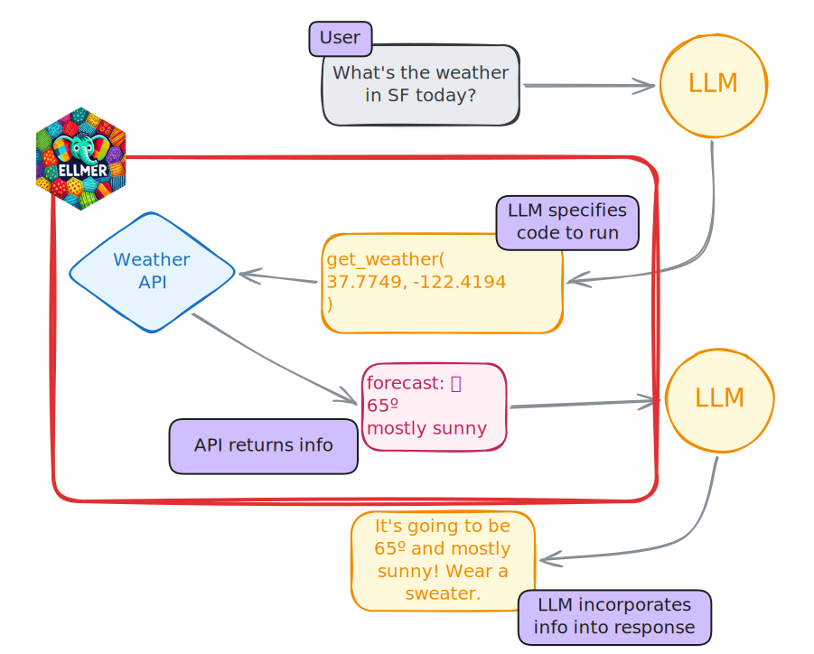
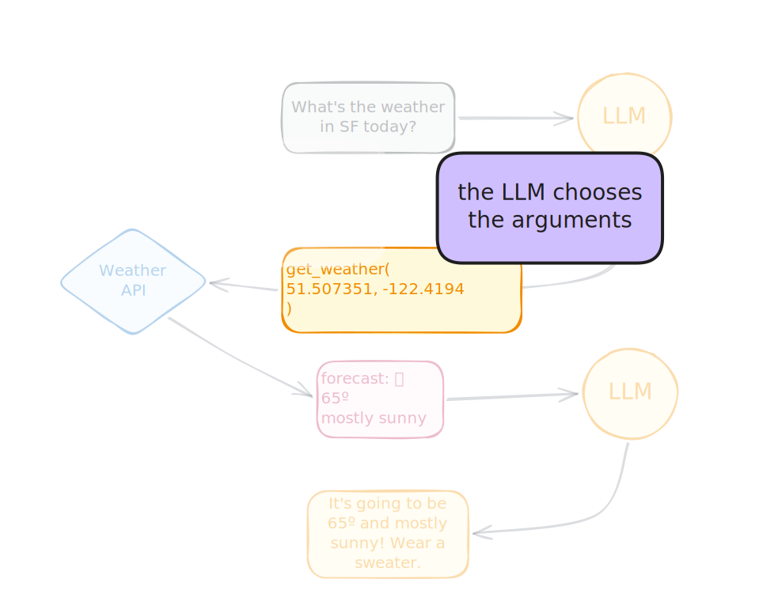

## How do LLMs actually work?

::: fragment
_On their own, can LLMs... access the internet? run code? send an email? interact with the world?_
:::

::: notes
Before we dive into tools, let's clarify what LLMs can and can't do. On their own, LLMs are quite limited. They can't access the internet, run code, or interact with systems. They only process the text you send them. This is where tools come in.
:::

## LLMs don't have access to real-time data

::: notes
The model can't access real-time weather data. No internet connection.
:::

```{.r}
chat <- chat("anthropic/claude-haiku-4-5")

chat$chat("What's the weather like in San Francisco?")
```

::: fragment
```{.markdown code-line-numbers="false"}
I don't have access to real-time weather data, so I can't tell
you the current conditions in San Francisco.
```
:::

## LLMs can't affect the world

::: notes
They also can't interact with the file system, send emails, or take any real-world actions.
:::

```{.r}
chat <- chat("anthropic/claude-haiku-4-5")

chat$chat("Write df to data/data.csv")
```

::: fragment
```{.markdown code-line-numbers="false"}
I'm not able to actually execute code or 
write files to your system. I can only provide 
code snippets and guidance.
```
:::

## Tool = function + metadata {.center}

::: notes
So how do we solve these problems? Tools! Also called functions or function calling.
:::

::: incremental
* Bring real-time or up-to-date information to the model
* Let the model interact with the world
:::

::: notes
Tools are extra capabilities that you give to the LLM, like the ability to check the weather or query a database.
These capabilities are things that the model can't do on its own.
The goal is to let the model pull in real-time or up-to-date information as needed.

They can also give the model new abilities to take action on behalf of the user.
:::

# Tools in R

## Tool = function + metadata 

**Step 1**

Write (or find) an R function that carries out your desired functionality. 

```{.r}
get_weather <- function(latitude, longitude) {
  # Return weather for that location
}
```

## Tool = function + metadata 

**Step 2**

Document that function for the LLM.   

```{.r code-line-numbers="5-9"}
get_weather <- function(latitude, longitude) {
  # Return weather for that location
}

get_weather_tool <- tool(
  fun = get_weather,
  description = "Get the weather for a location",
  arguments = # Specify arguments
)
```

## Tool = function + metadata 

Step 3: Register the tool   

```{.r code-line-numbers="11"}
get_weather <- function(latitude, longitude) {
  # Return weather for that location
}

get_weather_tool <- tool(
  fun = get_weather,
  description = "Get the weather for a location",
  arguments = # Specify arguments
)

chat$register_tool(get_weather_tool)
```

## Tool = function + metadata

```{.r code-line-numbers="|1-3|5|6|7|8-12|15"}
get_weather <- function(latitude, longitude) {
  weathR::point_forecast(latitude, longitude)
}

get_weather_tool <- tool(
  fun = get_weather,
  description = "Get the weather for a location",
  arguments = 
    list(
      latitude = type_number("Latitude"),
      longitude = type_number("Longitude")
  )
)

chat$register_tool(get_weather_tool)
```


## Tool = function + metadata

::: notes
simplify a bit
:::

```{.r code-line-numbers="|1|1-2|3-4|5-8|11"}
get_weather <- tool(
  \(lat, lon) weathR::point_forecast(lat, lon),
  name = "get_weather",
  description = "Get the weather for a location.",
  arguments = list(
    lat = type_number("Latitude"),
    lon = type_number("Longitude")
  )
)

chat$register_tool(get_weather)
```

## Now the model can tell us the weather

::: notes
Now when we ask about the weather, the LLM calls our tool. It figured out the lat/lon for San Francisco on its own. The tool returns real data, and the model formats it nicely.
:::

```{.r}
chat$chat("What's the weather in San Francisco?")
```

::: fragment

```{.markdown code-line-numbers="|1|2|3-10"}
◯ [tool call] get_weather(lat = 37.7749, lon = -122.4194)
● #> [{"time":"2026-05-01 14:00:00 PDT","temp":65,"dewpoint":1…
Here's the current weather for San Francisco:

**Current conditions (May 1, 2:00 PM PDT):**
- Temperature: 65°F
- Conditions: Mostly Sunny
- Humidity: 72%
- Wind: WSW at 7 mph
- Chance of rain: 0%
```
:::

# How does tool calling work?

::: notes
Let me walk you through exactly how tool calling works step by step. This is the key pattern you need to understand.
:::

## {.center style="text-align: center" transition="fade"}


::: notes
The conversation starts with a user sending a message to the chatbot.

In this example, the user asks whether they can go to the pool today - which requires knowing the weather.

The model doesn't have access to real-time weather data, just like we saw earlier with San Francisco.
:::

## {.center style="text-align: center" transition="fade"}


::: notes
Now imagine we've told the LLM that it has access to a tool called `get_weather()`.
Knowing that it needs weather information and doesn't have access to real-time data, the model decides to use the weather tool.

It sends back a message that includes a tool call - basically instructions to call the `get_weather()` function with the appropriate location argument.
The model uses its training data to figure out the right location format (like a ZIP code).
:::

## {.center style="text-align: center" transition="fade"}


::: notes
The programmer takes that tool call message and executes the actual function - in this case, querying a weather API with the location the model specified.
:::

## {.center style="text-align: center" transition="fade"}


::: notes
The weather API sends back some data:

* The forecast is mostly sunny
* High of 98ºF
* Low of 78ºF
:::

## {.center style="text-align: center" transition="fade"}


::: notes
The programmer sends that data back to the LLM.
Note that it's often in a pretty raw format, like JSON.
Not the kind of thing you'd want to read directly unless you're the kind of person who likes reading computer data formats.
:::

## {.center style="text-align: center" transition="fade"}



::: notes
The LLM doesn't mind JSON though, so it reads the data and generates a response that _incorporates_ the data from the tool call.
:::


## The LLM cannot run code by itself!

::: notes
This is crucial to understand - the LLM doesn't execute tools. It just asks you to run them.
:::

It just requests that tools be run.

::: fragment
The LLM controls:

::: incremental
1. **When** the tool is called
2. **How** the tool is called (i.e., the arguments)
:::
:::

## {.center style="text-align: center" transition="fade"}



## {.center style="text-align: center" transition="fade"}

::: notes
The LLM also chooses the arguments for the tool. It uses its knowledge to fill in the right values - using information from its training data.
:::


## Demo: weather tool {.center}

::: notes
But you're programmers! You can automate this. Let me show you how to define tools that run automatically.
:::

👩‍💻 [_demos/19_tools/19_weather-tool.R]{.code .b .purple}

## Helper function: `create_tool_def()`

```{.r}
create_tool_def(rnorm)
```

::: {.fragment}

```{.markdown}
Using model = "gpt-4.1".
tool(
  stats::rnorm,
  "Generates random deviates from the normal distribution with specified mean and standard deviation.",
  n = type_integer(
    "Number of observations. If length(n) > 1, the length is taken to be the number required.",
    required = TRUE
  ),
  mean = type_number(
    "Mean(s) of the normal distribution. Defaults to 0.",
    required = FALSE
  ),
  sd = type_number(
    "Standard deviation(s) of the normal distribution. Defaults to 1.",
    required = FALSE
  )
)
```
:::


# Your Turn `08_tool-calling` {.slide-your-turn}

::: notes
Now practice the full pattern: write a function, wrap it as a tool, register it, and chat. The function filters Georgia mortality data for a given county.
:::

1. Write a `get_county_mortality()` function that takes a county name and returns a summary of deaths by site with per-capita rates.

1. Wrap it as a tool with `tool()` and register it.

1. Ask the model about mortality in a specific county.



::: notes
to highlight: does the model have access to the data? what does the model control? how could we make this function better?
:::

## Some questions

::: {.fragment}
**Does the model have access to the data?**
:::


::: {.fragment}
No.
:::

::: {.fragment}
**What does the model control?**
::: 

::: {.fragment}
* When to use the tool.
* What arguments to pass to the function. In this case, just the year and country. 
:::

::: {.fragment}
**How could we make this function better?**
:::

::: {.fragment}
* Give the model access to the list of counties and years available. 
* Think through failure modes. 
:::

## Built-in web search tools

::: notes
ellmer also comes with built-in tools for popular providers. These solve the exact problem we saw earlier - the model couldn't look up current information. With a web search tool, it can.
:::

```{.r}
chat <- chat_anthropic()
chat$register_tool(claude_tool_web_search())
chat$chat("Who are the keynote speakers at R/Medicine 2026?")
```

::: fragment
Also available: `openai_tool_web_search()`, `google_tool_web_search()`
:::

