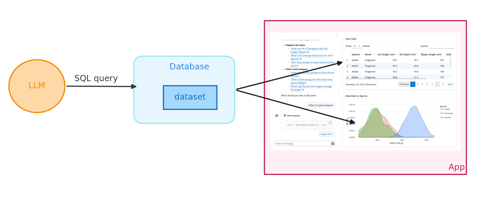
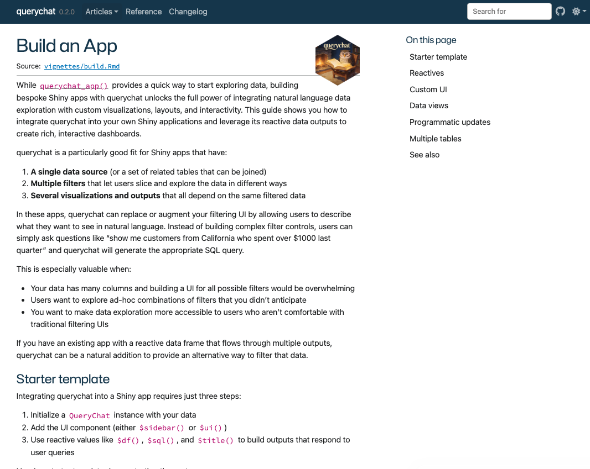

## What is [querychat](https://posit-dev.github.io/querychat/r/)? {.center}

::: footer
<https://posit-dev.github.io/querychat/r/>
:::

::: notes
querychat is a package from Posit that lets you explore tabular data using natural language. Instead of writing SQL or dplyr code, you just ask questions in plain English.
:::

::: incremental
* Explore data using **natural language**

* Built on top of **ellmer** and **Shiny**

* Works with data frames and database connections
:::

## How does querychat work?

::: notes
Here's the key insight: the LLM writes SQL queries, but a database executes them. The LLM never touches your raw data directly. This means results are reliable — no hallucinated numbers.
:::

::: incremental
1. You ask a question in natural language

2. The LLM writes a **SQL query**

3. A **database** executes the query

4. You get back real, filtered data
:::

## Benefits

::: notes
This architecture gives us several important properties, especially relevant for health data.
:::

::: incremental
* **Reliable** — the database runs the queries, not the LLM. No hallucinated numbers.

* **Safe** — limited to read-only queries. No data destruction.

* **Reproducible** — SQL can be exported and re-run.
:::

## The simplest version

::: notes
You can get started with just two lines of code. querychat_app() launches a full chat interface for exploring any data frame.
:::

```{.r}
library(querychat)

querychat_app(your_data)
```

## Demo {.center}

::: notes
Let me show you what this looks like. This is a full Shiny dashboard with querychat embedded — you can filter the data using natural language and the plots and map update automatically.
:::

👩‍💻 [_demos/06_querychat/06_querychat-dashboard.R]{.code .b .purple}

## {.center style="text-align: center" transition="fade"}


## {.center style="text-align: center" transition="fade"}



# Your Turn `08_querychat` {.slide-your-turn}

::: notes
Now it's your turn. Open the exercise file, run it, and explore the Georgia cancer mortality data with natural language. Try asking questions about counties, cancer sites, demographics, and trends over time.
:::

1. Open `08_querychat-app.R` and fill in the `querychat_app()` call.

2. Run it and explore the Georgia mortality dataset with natural language.

3. Try questions like:
   - "Which county had the most cancer deaths in 2023?"
   - "Show me total deaths by cancer site for Fulton County"



## {.center style="text-align: center"}



::: footer                                                              
  <https://posit-dev.github.io/querychat/r/articles/build.html>           
:::     

