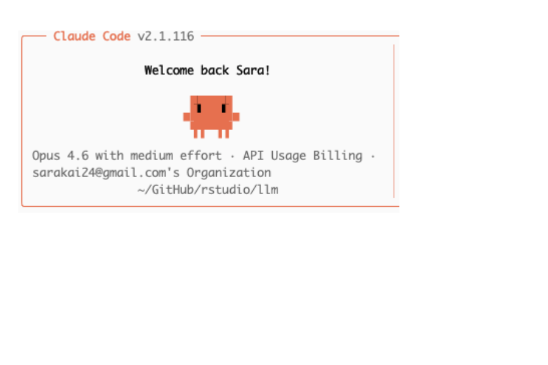
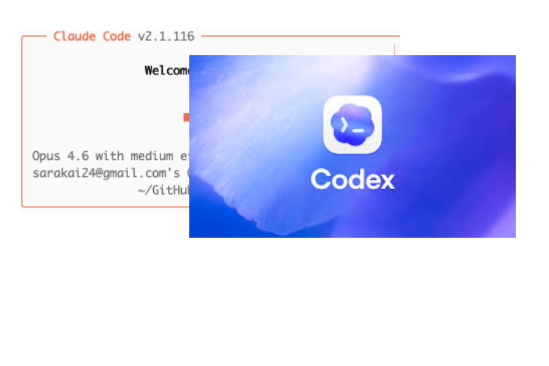
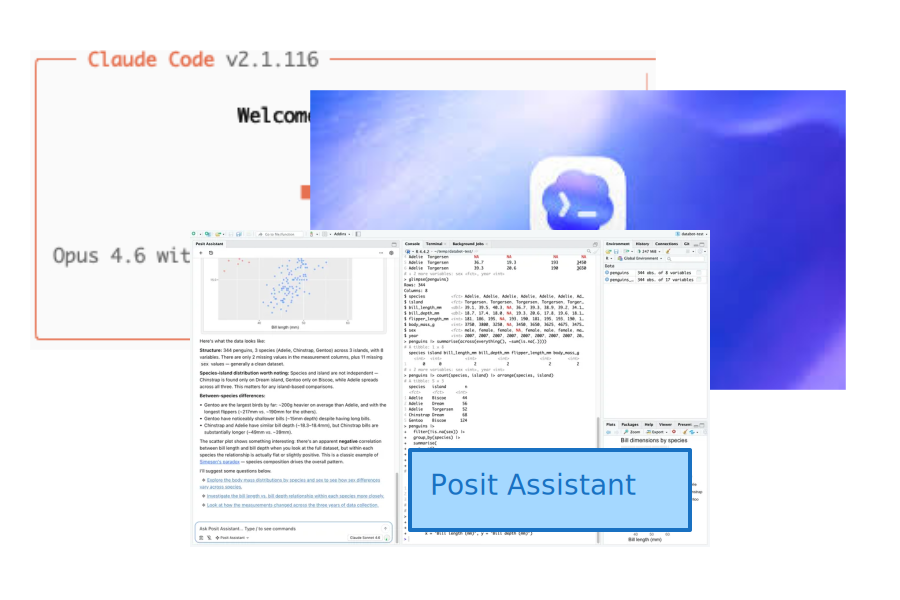

## What is an agent?

::: notes
FROM CLAUDE: An agent is an LLM with tools in a loop — it can observe, act, observe the result, and act again. We just learned about tools; an agent is what happens when you give a model tools and let it decide how to use them iteratively.
:::

::: {.incremental}
* Can gather information from the environment
  * e.g., what files are in a directory?
* Can alter the environment
  * e.g., write a dataset to a file
:::

## {.center style="text-align: center" transition="fade"}

::: notes
FROM CLAUDE: These diagrams illustrate how a coding agent works — it observes the environment, decides what to do, takes action (like running code or writing a file), then observes the result and repeats. It's tools in a loop.
:::

## {.center style="text-align: center" transition="fade"}

## {.center style="text-align: center" transition="fade"}

## Posit Assistant

::: notes
Posit Assistant is an AI coding assistant built into Positron. You can use it to help you write code — including Shiny apps. Let's use it to build on the querychat app we just explored.
:::

::: incremental
* Coding / data analysis agent in RStudio and Positron

* Works with R and Python

* Access to your R/Python session

* Successor to Databot
:::

::: footer
<https://posit-dev.github.io/assistant/docs/>
:::

## Demo {.center}

::: notes
Let me show you Posit Assistant in action — I'll use it to build a querychat Shiny app with a plot.
:::

## Add memory with `AGENTS.md`

::: notes
AGENTS.md is a memory file that gives Posit Assistant persistent context about your project. It loads automatically at the start of every conversation.
:::

::: incremental
* Markdown file that stores persistent context about your project

* Loaded automatically at the start of every conversation

* Include info like project structure, coding conventions, preferred libraries, etc.
:::

::: footer
<https://posit-dev.github.io/assistant/docs/features/memory/>
:::

## Skills

::: notes
Skills are specialized knowledge modules that extend Posit Assistant. They load automatically when relevant — no manual activation needed.
:::

::: incremental
* Specialized knowledge modules that load automatically when relevant

* Built-in skills include `shiny-bslib`, `quarto-authoring`, and more

* Create your own: project-level (`.positai/skills/`) or user-level (`~/.positai/skills/`)
:::

::: footer
<https://posit-dev.github.io/assistant/docs/features/skills/>
:::

## Your Turn: Extend the querychat app {.slide-your-turn}

::: notes
Use Posit Assistant to help you add features to the querychat app — like embedding it in a Shiny app with a plot or table. You don't need to know Shiny — the assistant will help you write the code.
:::

1. Open `_exercises/09_posit-assistant/09_posit-assistant-app.R` and run it to confirm it works.

2. Open Posit Assistant (sidebar or `Cmd+Shift+P` > "Assistant").

3. Ask it to help you extend the app (for example, add a plot).

4. Run the app and continue iterating.


