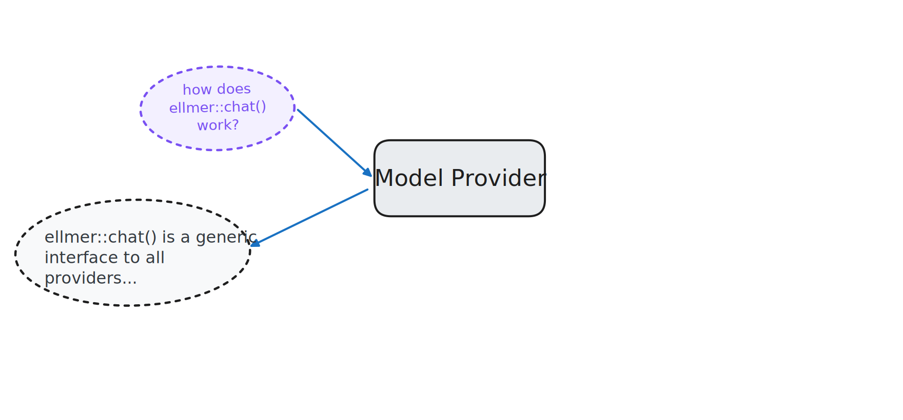
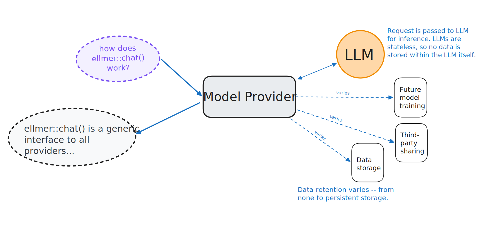
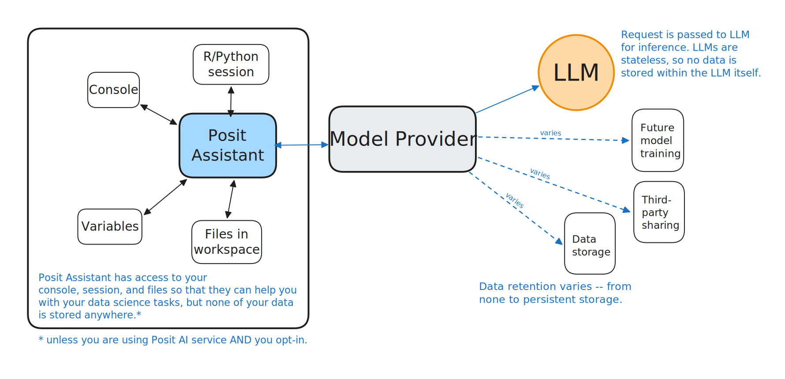

# [Privacy & Security]{.ph5 .pv3 style="background-color: rgba(255, 255, 255);"} {.no-invert-dark-mode background-image="assets/trust-fence.jpg" background-size="cover" background-position="center"}

::: notes
Before we wrap up, important to discuss privacy and security — especially relevant for those working with protected health data.
:::

## Model providers vs. LLMs

::: incremental
* **Provider:** The company that hosts the model (Anthropic, OpenAI, Google, etc.).

* **LLM:** The actual model that generates responses to your queries.

* LLMs are **stateless.** They have no memory of your prior requests.

* However, the model provider may **log and store** your requests.
:::

::: notes
The model doesn't remember you, but the provider's servers might.
:::

## {.center style="text-align: center" transition="fade"}

::: notes
FROM CLAUDE: These diagrams walk through the trust chain — your code talks to a model provider, which runs the model. Your data flows through the provider's infrastructure. The question is: what does the provider do with it along the way?
:::

## {.center style="text-align: center" transition="fade"}

## {.center style="text-align: center" transition="fade"}

## {.center style="text-align: center" transition="fade"}

## {.center style="text-align: center" transition="fade"}

## You* need to trust your model provider

\* or more likely, your organization

::: {.fragment}
* Know what your model provider does with your data
:::

::: {.fragment}
* ellmer, querychat, shinychat, etc. will never store your data anywhere. They pass the request directly to your specified model provider. 
:::

::: {.fragment}
* Posit Assistant will only store your data if a) you use Posit as your model provider and b) you opt-in. 
:::

## The good news

::: notes
FROM CLAUDE: This is the key reassurance for the audience. ZDR and BAA agreements are standard practice — most major providers offer them. The point is that this is a solved organizational problem, not a technical barrier.
:::

::: fragment
Your organization can work out a zero data retention (ZDR), HIPAA-compliant agreement, or other arrangements with model providers. These arrangements are common.
:::

::: fragment
**Learn more:** <https://posit.co/blog/trust-llm-tools/>
:::

## Learn more

::: notes
These are the Posit packages for working with AI. We've focused on ellmer and shinychat today, but there are others for different use cases.
:::

# Thank you!
